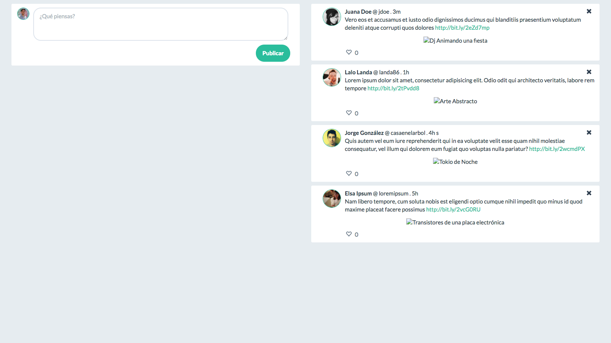

# Taller - Javascript

## Mini Twitter

### Se pide construir una plataforma tipo *Twitter* de un sólo usuario:
- Utilizando sistema de *grids* se debe dividir el viewport en **2 columnas** **(Se recomienda [Bootstrap](http://getbootstrap.com/))**:
    - En la columna de la izquierda: Crear un campo de texto donde el usuario pueda ingresar el texto del *tweet* y un botón para confirmar la creación.
    - En la columna de la derecha: Los *tweets* deben ser listados en bloques. (Cada *tweet* con un nuevo *row*).

- Cada *tweet* de la lista debe tener a su lado un link que contenga un *icono* para dar *like*, un contador de likes (por defecto es cero) y un botón para eliminar el *tweet* **(Se recomienda usar [fontawesome](https://fontawesome.com/get-started))**.
- El link del *ícono* debe dar like al *tweet*. Al hacer esto, agregar o quitar con Jquery una clase **class='likeable'** que debe cambiar de color este ícono. 
- Al dar click en el ícono de like debe, con jQuery, sumar o restar un like al tweet, dependiendo el caso.
- El botón de eliminar debe remover el *tweet* de la lista.

## Tomar en cuenta

- Se debe utilizar **GIT para el control de versiones**.

- Buenas prácticas y uso de identado correcto.

- Agregar el CSS  y javascript en un **archivo externo**.

- Agregar al proyecto un archivo **README.md** que debe contener el link al proyecto en Github Pages.

- Al finalizar, guarda los cambios y súbelos a **Github Pages**.

Luego debes enviar los cambios (vía push) y subir el link del repositorio a la sección correspondiente en la plataforma [empieza](https://empieza.desafiolatam.com "Desafío Latam").
 